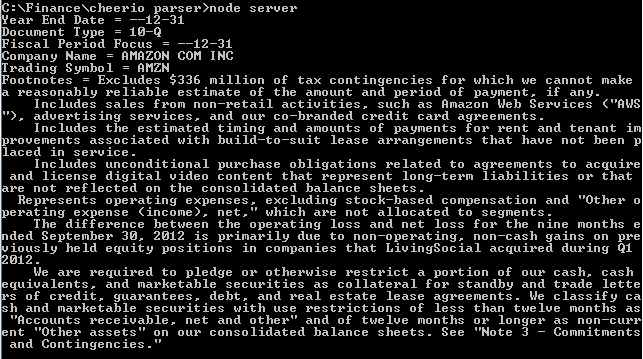

## Using NodeJS to parse XBRL file 
 

XBRL (eXtensible Business Reporting Language) is a computer readable XML based language designed to enhance the communication and analysis of financial data. It enables the electronic tagging of financial data allowing the data to be identified in terms of standard accounting or tax concepts.

iXBRL or _Inline XBRL_, is a more recent version of the language which allows human-friendly presentation of XBRL documents. An  iXBRL report can be viewed like a web page and the XBRL can be extracted if the recipient wants to use the tagged data. iXBRL is the format of XBRL being adopted in the UK and Ireland for tax reporting purposes [[1]](http://www.pwc.ie/services/audit-and-assurance/audit-and-accounting/xbrl.jhtml).

### App Functionality

This App uses a XBRL file stored on the [SEC's](http://www.sec.gov/) [EDGAR system](http://www.sec.gov/edgar/aboutedgar.htm).
The file is a [10-Q](http://www.sec.gov/answers/form10q.htm) quarterly report form submission by Amazon for the current year ending 31st December.
The full path to the file is: http://www.sec.gov/Archives/edgar/data/1018724/000144530513002495/amzn-20130930.xml

NodeJS server using [requestJS](https://github.com/request/request) gets the XBRL file from a remote server using HTTP.
[CheerioJS](https://github.com/cheeriojs/cheerio) enables the use of JQuery on the server and can also parse HTML and XML documents. Cheerio is used here to parse the XBRL document. The results of the parsing are then simply logged to the console.

### Main Technologies Used

- [NodeJS](http://nodejs.org/)
- [RequestJS](https://github.com/request/request)
- [CheerioJS](https://github.com/cheeriojs/cheerio)

### Running the App

- clone the repository
- npm install
- node server.js

## Screen Shots

	

Michael Cullen 2014
